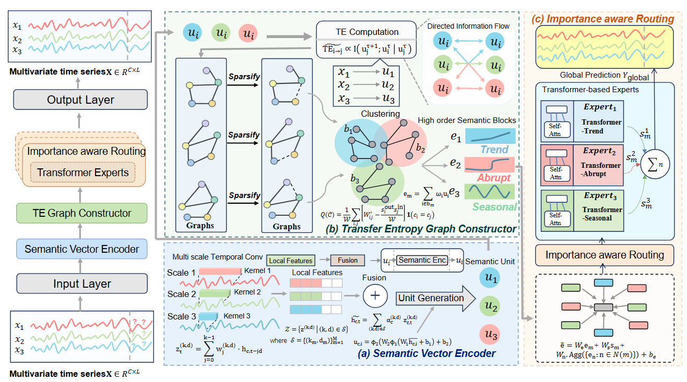
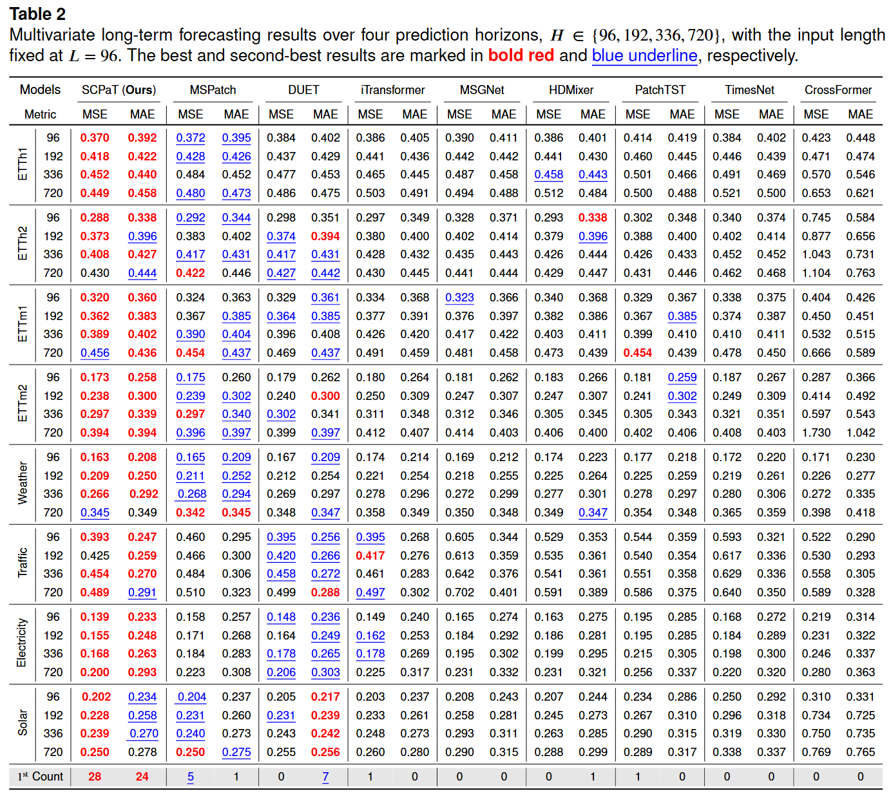
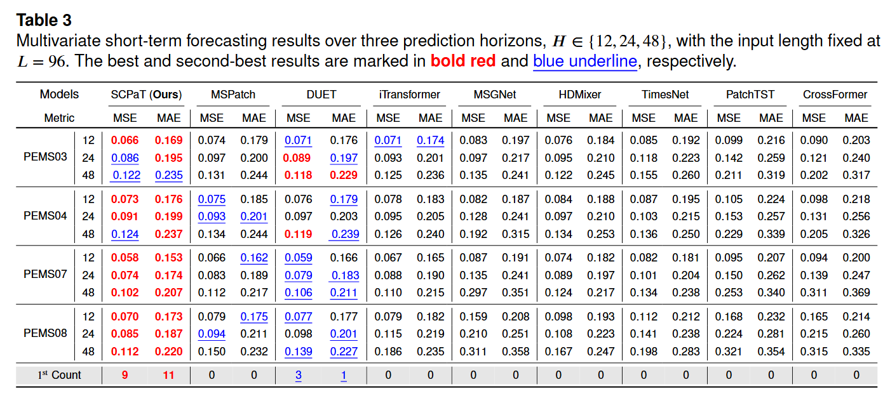

# Rethinking Patch-Based Multivariate Time Series Forecasting with Semantic Structured Partitioning

Official PyTorch implementation of **SCPaT**, a semantic-structured framework for multivariate time series forecasting (MTSF).

## Overview

Most patch-based forecasting methods divide a sequence using fixed, multi-scale, or length-adaptive rules. Although these strategies improve computational efficiency or partitioning flexibility, they do not explicitly preserve the semantic coherence of local temporal patterns or model higher-order interactions among heterogeneous dynamics.

SCPaT revisits temporal partitioning from a semantic-structure perspective. It represents local temporal patterns as semantic units, builds a sparse directed dependency graph among those units, and uses importance-aware routing to emphasize the relationships that are most useful for forecasting.

The implementation follows the three components introduced in the paper:

1. **Semantic Vector Encoder.** Multi-scale dilated temporal convolutions extract local patterns under different receptive fields. Adaptive fusion combines the scale-specific features, and variation-aware pooling converts local segments into semantic units.
2. **Transfer Entropy Graph Constructor.** A differentiable transition score estimates the directed contribution of each source unit to a target unit conditioned on the target history. The strongest outgoing dependencies are retained to form a sparse semantic graph.
3. **Importance-Aware Routing.** Graph aggregation produces higher-order semantic context. A noisy Top-P router then assigns each semantic representation to a data-dependent subset of three independently parameterized Transformer experts.

The routing objective combines load balancing, expert importance balancing, and an entropy regularizer. The forecasting loss and routing loss are optimized jointly.



## Repository Structure

```text
SCPaT/
|- data_provider/                 # Dataset loaders and preprocessing
|- exp/                           # Long- and short-term experiment pipelines
|- layers/SCPaT_layers.py         # Semantic graph and routing layers
|- models/SCPaT.py                # End-to-end SCPaT model
|- scripts/
|  `- Long_term_forecasting/
|     `- ETTm1.sh
|- utils/                         # Metrics, losses, augmentation, and training utilities
|- run.py                         # Main training and evaluation entry point
`- requirements.txt
```

## Environment Setup

Create a Python environment and install the pinned core dependencies:

```bash
pip install -r requirements.txt
```

The experiments are implemented in PyTorch. A CUDA-capable GPU is recommended for reproducing the full benchmark results.

## Data Preparation

Download the benchmark datasets from the data collection provided by [iTransformer](https://drive.google.com/file/d/1l51QsKvQPcqILT3DwfjCgx8Dsg2rpjot/view?usp=drive_link), then place the extracted files under `./data/`.

The paper reports experiments on 12 datasets:

| Task | Datasets | Prediction horizons |
| --- | --- | --- |
| Long-term forecasting | ETTh1, ETTh2, ETTm1, ETTm2, Weather, Traffic, Electricity, Solar | 96, 192, 336, 720 |
| Short-term forecasting | PEMS03, PEMS04, PEMS07, PEMS08 | 12, 24, 48 |

The current repository provides the ETTm1 training script. Configurations for the remaining datasets will be released after the paper is published. If your data are stored elsewhere, update `--root_path` and `--data_path` in `ETTm1.sh`.

## Training and Evaluation

The currently released ETTm1 configuration uses an input length of 96 and prediction horizons of 96, 192, 336, and 720.

For example, run the ETTm1 long-term forecasting experiments with:

```bash
bash ./scripts/Long_term_forecasting/ETTm1.sh
```

The script invokes `run.py` with horizon-specific patch lengths and dropout rates. Checkpoints are written to `./checkpoints/` by default.

### Key Arguments

| Argument | Description |
| --- | --- |
| `--seq_len` | Historical look-back length |
| `--pred_len` | Forecasting horizon |
| `--patch_len` | Length of each temporal unit |
| `--alpha` | Fraction of the strongest outgoing dependencies retained for each semantic unit |
| `--top_p` | Cumulative probability threshold used to select the active expert subset |
| `--d_model` | Latent representation dimension |
| `--n_heads` | Number of graph-attention heads |
| `--e_layers` | Number of SCPaT encoder layers |
| `--enc_in`, `--c_out` | Number of input and output variables; these values must match |

## Results

The paper evaluates SCPaT using MSE and MAE on eight long-term and four short-term forecasting benchmarks.

For long-term forecasting, SCPaT achieves the best or second-best performance in most settings. Averaged over the four ETT datasets, it reduces MSE by **4.6%**, **7.1%**, and **4.1%** compared with PatchTST, TimesNet, and HDMixer, respectively.



For short-term forecasting, SCPaT achieves an average MSE of **0.0886** and MAE of **0.1938** across the four PEMS datasets. Compared with DUET, the strongest baseline on average, the corresponding errors are reduced by **5.8%** and **2.6%**.



In the result tables, the best values are highlighted in **bold red**, and the second-best values are shown with a <u>blue underline</u>.

## Acknowledgements

This repository builds on the experimental infrastructure and ideas provided by the following projects:

- [PatchTST](https://github.com/yuqinie98/PatchTST)
- [Time-Series-Library](https://github.com/thuml/Time-Series-Library)
- [iTransformer](https://github.com/thuml/iTransformer)

We thank their authors for making their code and datasets publicly available.
